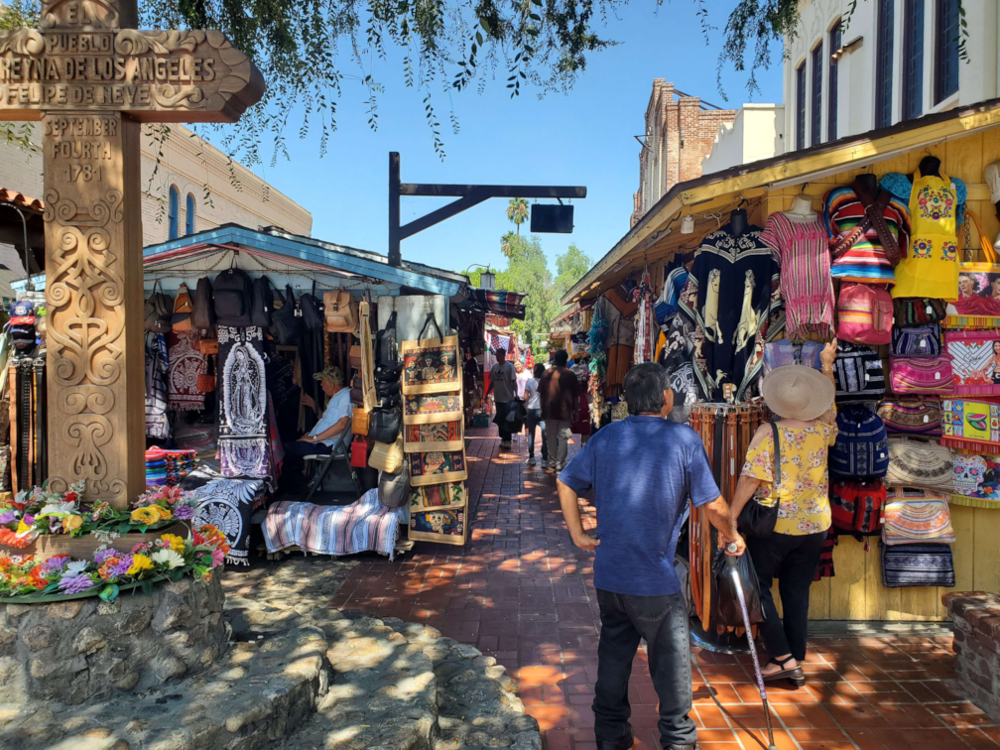

At the start of 2023, a friend and myself both shared in our group chat that one of our resolutions for the year was learning Spanish. I'm definitely no stranger to trying and failing in this pursuit, having left high school Spanish and a few short-lived Duolingo attempts with not much more than "¿Donde está la biblioteca?" or "La niña come arroz," but by the end of the month we decided to team up as accountibility partners and give it one more shot.

## Language Transfer

After some research (read: "best spanish app free" in the YouTube search bar while I ate), we landed on trying out Language Transfer, a collection of 90 ~7-15 minute audio lessons. The approach it takes is unconventional, but I fell in love with it pretty much immediately. We did roughly one lesson a day, finishing in about 3 months at the start of May.

The first thing the course teaches is a set of methods to convert a vast amount of English words with Latin roots to Spanish. For example, words ending **-tion** tend to become **-ción** in Spanish: **preparation→preparación**, **information→información**, etc. This rule plus the others taught give you a base vocabulary of thousands of words in just the first maybe 30 minutes of the course.



The approach it takes to grammar and other vocabulary is similar, using the link between English and Latin and even delving into broader linguistic concepts. Not only did the full course give me such a strong base that I've felt little need to do explicit grammar study since, but progress during the course was also incredibly rapid. One moment that really stands out in my mind is forming this sentence in lesson 9:

> No intento justificarme, pero quiero explicarte algo. — I'm not trying to justify myself, but I want to explain something.

Language Transfer's one downside is that much like Tame Impala, it's just one guy™, and so your target language might not have a course available. But if it does, and especially if it's Spanish, I can't give a bigger recommendation.

## All In on Input

For about a month after completing Language Transfer, we were a bit lost on what to do next, and ended up bouncing between a couple vocab apps. Tried a couple [Anki](https://apps.ankiweb.net/) decks, tried [Clozemaster](https://www.clozemaster.com/) for a bit, but nothing really stuck.

Around this same time is when I was first introduced to the concept of language acquisition via **comprehensible input**, the idea that the most effective way to acquire a language is to spend time receiving **comprehensible input** — that is, listening to and reading language that is more advanced than your current level, but still conveys its message successfully.



This idea really resonated with me and made a lot of sense, and luckily, I'd actually already started doing this back around March by beginning to watch a couple episodes of the original Pokémon series in Spanish. So, by the end of June I completely ditched the vocab apps and shifted my focus entirely to consuming native Spanish content.



The thought of just jumping into the language in this way can be scary to some, but at least personally I've found it to be quite enjoyable! A couple things you can keep in mind to best set yourself up for success:

- Having a broad idea of how a story goes before jumping in helps a ton in avoiding times that you feel completely lost, whether that's from seeing it before in English or even looking up a plot summary beforehand.
- While it's important to eventually add in pure listening practice as well, I found having matching Spanish subtitles to be crucial at the start, allowing me to notice words and phrases that I couldn't quite catch with just my ears. Look for subtitles marked [CC] or [SD], or else they may not actually match the dubbed script which gets confusing.



Some more things I watched throughout the year:

- Lots of Pixar and other animated movies, some I'd seen some I'd hadn't. On Disney+ the newer the film the more likely it will have CC subtitles. Also Elemental made me cry
- Chowder S1, Gumball S1, Scott Pilgrim Takes Off
- Into the Spiderverse over 10 times
  > Wait, what?

## Repetition

As with many things in life, this was the result of watching a YouTube video and saying "Yeah, that makes sense. Why not?"



**tldw:** The power of repetition when learning a language is undervalued, especially repetition in listening. You learn a language by first understanding it, listening to something on repeat allows you to glean much more depth than a single listen, and combining those two things can lead to rapid growth.

Right now I'm on watch #14, having cut down the film to just its dialogue around watch #5. The main thing I've distinctly noticed is phrases sort of getting stuck in my head like a song lyric would, even now when it's been over a month since my last watch. This coming year I want to pick it back up and possibly complete the full 50, so hopefully I'll be reporting back with a more thorough analysis for you in a year.

Speaking of lyrics, I also had a couple songs that I went through the process of learning all the lyrics to. I've found this quite helpful, both analysing the lyrics alongside their English meanings, as well as needing to match the singer's pronunciation to keep up with the beat.

## Reading

At the start of June I also added reading to my routine when I was recommended *Pokémon Adventures*, the original Pokémon manga, by a friend. I found that choosing a graphic novel as my introduction to reading was a good call as the drawings can provide additional context as to what is happening in the story. Though there were of course.. exceptions...



When I first started, each 15 page chapter would take me ~30 minutes to complete, but nowadays tends to take me less than half that while looking up just a couple words, so that's pretty cool! It's worth noting that for now I've chosen to have reading serve as a more "intensive" form of immersion, meaning that I look up words that I don't know much more often than when watching a show or movie.

## A Visit Home / Speaking

In August I had the opportunity to take a trip back to my hometown in Southern California, staying with my childhood best friend's family for the whole month which was awesome. The practice routine was put on pause to make the most of my time there, but I did of course still end up interacting with the language as it's SoCal, mainly a little reading in museums and art exhibits, plus finally putting my speaking ability to the test.

It was.. *drumroll...* not horrendous! Not fantastic either, but better than I expected having put in almost no actual speaking practice so far. Some highlights were helping a man from Panama City with directions on the metro, using Spanish with the shopkeepers on Olvera Street, and striking up a conversation with the couple seated next to me on my returning flight that were from Mexico.

This didn't spur me to start speaking practice yet as I was still finding that even if I was slow and clumsy in forming my own thoughts, my level of understanding was what would eventually halt a conversation. However, I have started to have this perception challenged in the following months.

## Reading 2

Around late October, I was wanting to read through the Scott Pilgrim comics before the release of the show in November, and decided it'd be a good idea to give it a go in Spanish. Definitely much more text heavy and conversational, but a nice challenge and exposure to lots of new phrases.

By the end of the first volume where the plot starts to deviate more heavily from the movie I found that I had to start reading each chapter first in English, then in Spanish. I'll probably do a Spanish only re-read soon, plus seek out some more similarly conversational content as I really enjoyed that aspect.



## Counting the Hours & Looking Ahead

Reviewing and setting new resolutions for 2024, I tallied up and roughly estimated that from May to the end of 2023, excluding August, I averaged ~40 minutes/day of listening/reading. There are also a couple things that I worked into my daily life and so aren't as trackable:

- Texting in Spanish with my friend I began learning with: This unfortunately pewtered out around summer as he never quite got the same semi-consistent practice going after Language Transfer (te extraño mucho Cass)
- Setting my phone, computer, and common apps+websites to Spanish, and beginning to follow/join some Spanish-speaking YouTube channels and Discord servers around my interests: I did these around July but believe I definitely could have sooner
- Translating [rivals.academy](/rivals-academy): While the articles themselves were of course not translated by me (shoutouts Doka o7), I did tend to give most at least a quick skim, and also went through the process of referencing other Spanish websites for things like screen reader accessibility titles and labels

### 2024 Goals

- Pushing myself to do 500 hours of input this year, doubling my average to 1hr20m/day
- Begin some text-only and audio-only content, with no extra visual element for context
- Add more conversational content, especially things like street interviews which are right now more difficult for me to understand than scripted/dubbed material
- Switch to a monolingual dictionary for looking up new words rather than translating
- Restart consistent writing practice and start conversational practice, even if occasional

Overall, this is the furthest I've ever gotten in a second language by a mile, and I'm elated with how the year has gone + excited for what the next will bring. ¡Hasta la próxima!

