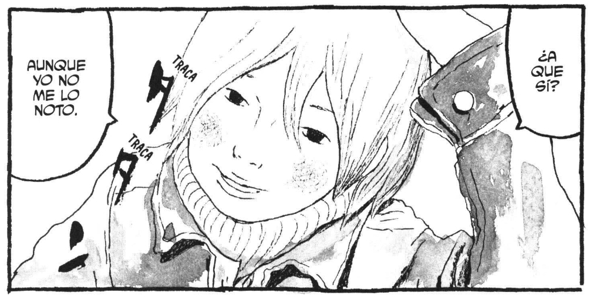

Two years ago, after many failed past attempts, I began my most successful foray yet into learning a second language, roughly following [Refold](https://www.youtube.com/watch?v=Jo4ds4mxuhU) methodologies after having completed [Language Transfer Complete Spanish](https://www.languagetransfer.org/complete-spanish). You can read my one year update [here](/a-year-of-spanish).

At the end of that update, I set myself the primary goal of reading and listening to 500 hours of Spanish content this year, and I'm proud to say that I did achieve this! 150 to 650 hours is quite a big jump, so let's talk all about what this actually entailed, how I'm feeling about my progress, and how I plan to continue forward.

## Listening

As with last year, the majority of my time spent with the language was through listening, gradually increasing the difficulty of the content I consumed as I understood more and more. I started the year by beginning to venture into original Spanish shows and movies on Netflix, rather than the dubbed content I had been watching. The longest show I watched was *Club de Cuervos*, after which I had acquired some very essential vocabulary: a wide variety of Mexican curse words and insults.



Dubbed shows remained useful as less challenging content to practice listening comprehension and wean off subtitles.



I also binged the [Easy Spanish](https://www.youtube.com/@EasySpanish) YouTube channel at the start of the year, street interviews in Mexico City and Barcelona that served as even more conversational content than scripted shows and movies. It wasn't until the latter half of the year that I became able to follow these without any subtitles, and at this same time, my general YouTube consumption also skyrocketed. Some of my favorite channels have been [Atherion](https://www.youtube.com/@atherion), [criesinquechua](https://www.youtube.com/@criesinquechua), and [Cordura Artificial](https://www.youtube.com/@CorduraArtificial), as well as [Un Mundo Inmenso](https://www.youtube.com/@UnMundoInmenso), [Fran Argerich](https://www.youtube.com/@Fargerich_), and [Urbanopolis](https://www.youtube.com/@UrbanopolisYT) for content on geography and cities.

### Podcasts!

I started incorporating podcasts into my routine around halfway through the year, and immediately fell in love with the medium. Not only is it easy to incorporate into other daily activities or habits, but the density of language is also quite a bit higher than shows or movies, and the lack of visual context as a crutch adds another layer to the listening practice. I've been fairly consistently listening to at least one 30 to 60 minute episode each day, which has helped me immensely in hitting my goals.

I first found [No Hay Tos](https://www.nohaytospodcast.com/), an intermediate learners podcast focused on Mexican Spanish. Hosted by two Spanish teachers, I found it a fantastic introduction to the medium at my level. I especially love the episodes in which they highlight common mistakes, or cover grammar/vocabulary concepts with English vs. Spanish sentence examples. Explicit explanation of these aspects of the language can be really helpful in speeding up their acquisition, once you've reached the level that it can be explained to you in Spanish.

After about 50 hours spent with that, I moved onto [Radio Ambulante](https://radioambulante.org/), an NPR podcast covering Latin American history and current events. This was definitely much more challenging at the start, with lots of rewinding or even reading along with the transcript/translation. Whether from hearing too much unfamiliar vocabulary at once, or losing focus just enough to miss a crucial detail, it can be easy to get lost in such a long-form story. Luckily, the show is so engaging that I've been able to pull through, and nowadays I can get through most episodes with just a couple of word lookups.

### Phonetics

As an aside, I found a little bit of time spent studying Spanish phonetics to be incredibly helpful, both for my own pronunciation but as well as for my comprehension. I've recommended these two videos in particular to multiple other Spanish learners as an overview:





Another very helpful resource has been [Clases con Clau](https://www.youtube.com/playlist?list=PLzIqwIlhO5bhf6vywsTFz2cgUw0MNryt0):



## Reading

Another goal I set at the start of the year was to begin to incorporate pure reading into my routine. I technically didn't fail at this, reading exactly one (1) non-comic book: *El principito*. However, obviously not ideal. 

Even including comics/manga, I read a lot less than last year, falling off from the habit after becoming bored with continuing *Pokémon Adventures*. I re-read *Scott Pilgrim*, read *Ping Pong* and *Sunny* by Taiyo Matsumoto, and that's about it. 

I do thoroughly enjoy reading once I get into a story, and find it incredibly beneficial to my vocabulary, so I hope to make it a staple of my routine again in the coming year. It'll just be a matter of finding the right material for me.



### Throwaways

Some miscellaneous activities I also did or tried throughout the year:
- Continuing to have my phone/computer set to Spanish, searching Google in Spanish
- Researching (read: adding "reddit" to the end of the search bar) various topics primarily in Spanish, mainly in regards to regions/cities of Spain
- Enrolling in an [online architecture course from a Colombian university](https://www.edx.org/learn/art/universidad-del-rosario-historia-global-de-la-arquitectura-islamica-espacio-ciudad-arte): Unfortunately, I only put about 10 hours into this─I plan to come back to it, as the subject is very interesting, but need to improve my level just a bit to make working through university-level material less of a slog

## Where I'm At / Looking Ahead

I enjoy reading other language learners' progress updates like this one. Discussion of different learning methods, practicing different skills at different times throughout the process, it's all very interesting to me. However, one thing I've learned through these is to take self-reported assessments of skill with a grain of salt. Personality can play a huge role in this self-perception, and two people at the same level may feel wildly different about their abilities.

With that said, I am definitely quite happy with my progress. I'm proud of myself for sticking to the time commitment that I set out for myself at the start of the year, and the difference in my comprehension between then and now is night and day. There are hiccups, but for the most part I can understand just about any piece of content thrown in front of me with just a couple of lookups. Watching YouTube on a topic I'm interested in, I've found myself zoning out and losing focus, but still understanding subconsciously, or otherwise forgetting that what I'm watching is even in Spanish: "I need to close this video and get in some Spanish listening instead. Oh, I am." It's good to focus on the areas that I still need to improve, but moments like this give me perspective on how far I've come.

### Output

Speaking/writing is another story. While I have improved by virtue of my overall level being higher, I'm severely lacking in confidence and fluidity, as I've essentially still not put any time into dedicated conversational practice. It's not that I don't feel "ready," but rather that it's simply been easier to continue with the comfortable routine I have going without some sort of external pressure or push to start. I've had chance encounters and conversations with neighbors, and even tried joining a couple voice chats in a "Spanish/English Learning" Discord server, but came to the conclusion that for me, at least starting out, speaking with an actual tutor will be most beneficial.

Luckily, this external push has finally come! I've recently applied and been admitted to [NALCAP Spain](https://www.educacionfpydeportes.gob.es/eeuu/convocatorias-programas/convocatorias-eeuu/nalcap.html), a program by the Spanish government for native English speakers to serve as assistant English teachers in the public school system. This essentially means that as long as nothing goes wrong with my placement and the visa process, I have six months from the time of writing to improve as much as possible before going to live in Spain.

And so, here are my goals for these six months:
- 75 to 100 hours of output, split between daily activities of corrected writing or pronunciation practice, and meeting with a tutor once or twice a week
- Hit 1000 hours of total input, maintaining my recent average of roughly 2 hours per day
- Incorporate reading more heavily into my routine, and audit another course or two

I am incredibly excited for what this next chapter holds, and can't wait to share it with you. ¡Hasta entonces!

