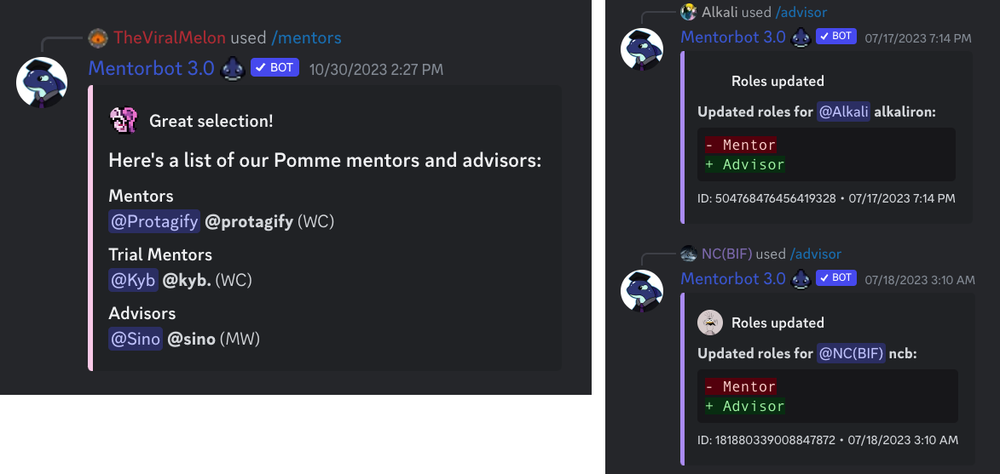

Built with [discord.py](https://discordpy.readthedocs.io) and [redis](https://redis.io), Mentorbot is my longest running project by far, initially launched just a few months after I first began programming in 2018. As such, it's been through a couple iterations alongside Discord's API, and seen features come and go as the platform's own feature set has expanded over the years.

Mentorbot's original and most popular feature is seen above, serving as a quick reference for hitboxes or other game info with a link to the full data on the [Rivals Academy Library](/rivals-academy). You may notice here and in the next section that a number of my other projects have in a large way grown out of what were initially Mentorbot features, adapting the UX between Discord and traditional web.

## `/invite`

Created to drastically speed up the Steam matchmaking process, this feature allows users to seamlessly invite other members without leaving Discord. Read more about the why and how of this feature in my post for SteamJoin [here](/steamjoin).



## Mentor Commands

Mentorbot's mentor commands give users a quick view of volunteer coaches available for their character, one of the core draws of the Rivals Academy Discord as a community. Another set of admin commands give these volunteers the ability to manage when and how they appear on these lists.

