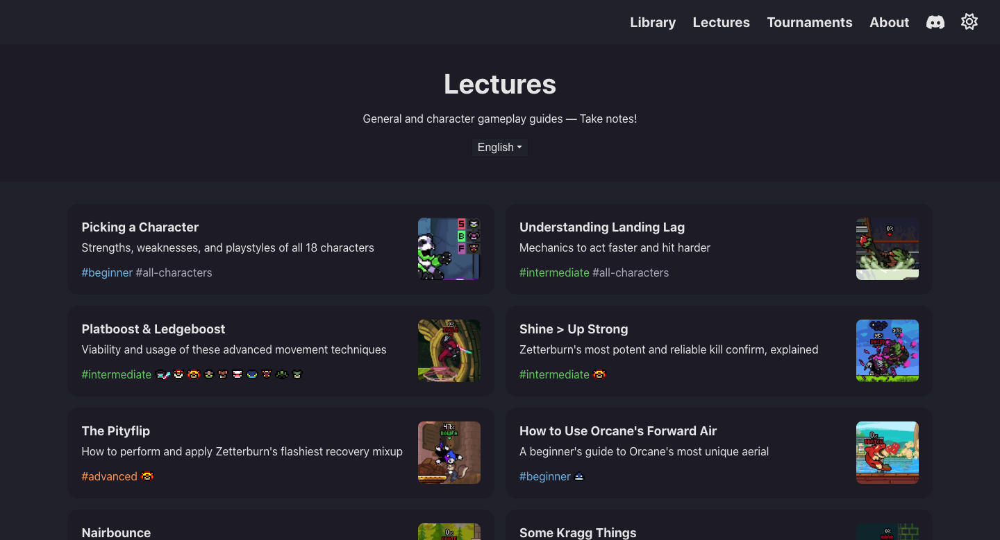
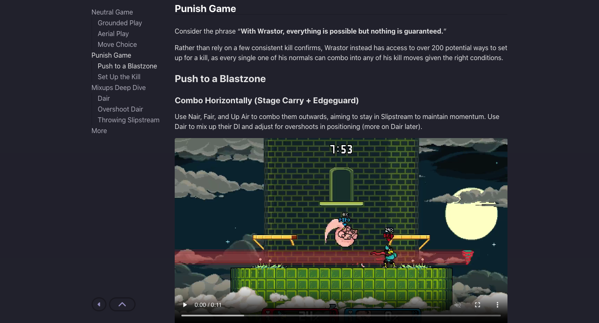
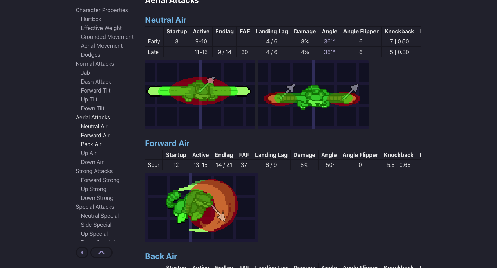
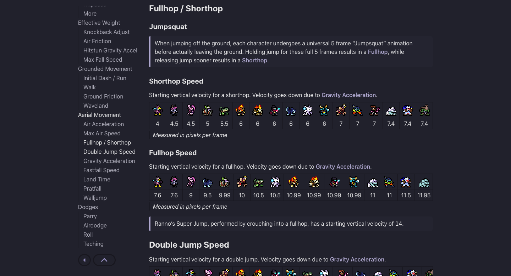

Built with [Hugo](https://gohugo.io), JavaScript + CSS, and [FFmpeg](https://ffmpeg.org) + [ImageMagick](https://imagemagick.org) for media optimization, with automated site builds via [GitHub Actions CI/CD](https://github.com/features/actions) deployed onto [Cloudflare Pages](https://pages.cloudflare.com)

Rivals Academy is the largest website surrounding the indie fighting game [Rivals of Aether](https://rivalsofaether.com), serving as the central hub for those seeking resources to improve their gameplay. The site receives roughly 300k requests each month, with a 100/100/100/100 [Google Lighthouse](https://developer.chrome.com/docs/lighthouse) score on most pages.

## Lectures

The first main section of the site is the [Lectures](https://rivals.academy/lectures), a collection of strategy guide articles featuring 20+ authors, available in both English and Spanish.

This feature set is the bread and butter of a static site generator like Hugo, so setting up this system of posts, tags, and even i18n was more or less a matter of following a set of well-defined and documented practices.

That being said, there have been a number of technical considerations that needed to be made as the site grew in scale, both in content and the amount of users/visits.

1. Compressing video file sizes with [FFmpeg](https://ffmpeg.org). As the compression of video is much more intensive than images, this is performed with a bash script as a part of the publishing process for new guides, rather than automated during build.
2. Even with compressed video, user experience was taking a hit on longer pages due to the preloading of all videos' metadata taking precedence over a user playing a video at the top. This was especially apparent on mobile or otherwise shotty connections. With a bit of trial and error, the solution I've landed on uses the [IntersectionObserver API](https://developer.mozilla.org/en-US/docs/Web/API/Intersection_Observer_API) to instead only load this metadata once each video is onscreen or will be shortly. Right now, there's still a balance to be found between increasing the range of this observer to ensure video thumbnails are loaded by the time they're onscreen, versus avoiding the initial issue of these loadings taking precedence over the user playing a video.

## Library

The second main section of the site is the [Library](https://rivals.academy/library), home to visualizations and detailed stats for all characters, attacks, and stages in the game.

These visualizations are available at multiple in-game resolutions, scaled at build with [ImageMagick](https://imagemagick.org) and [GitHub Actions](https://github.com/features/actions).

Both the pages themselves and a public API of the data are generated from the same edited YAML, made possible by Hugo's shortcodes and encoding features.



The glossary page provides definitions for all the listed stats and more, alongside automated character comparisons when applicable.

