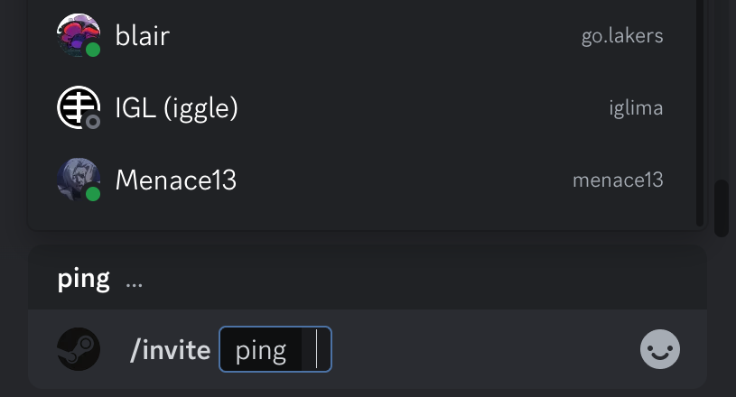
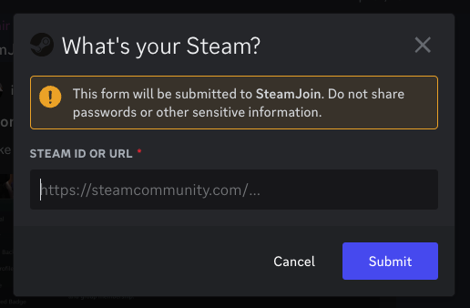
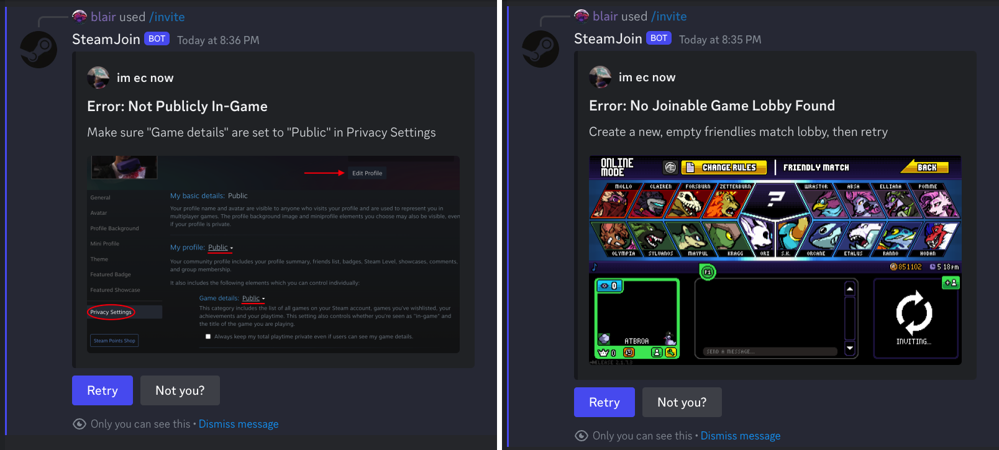
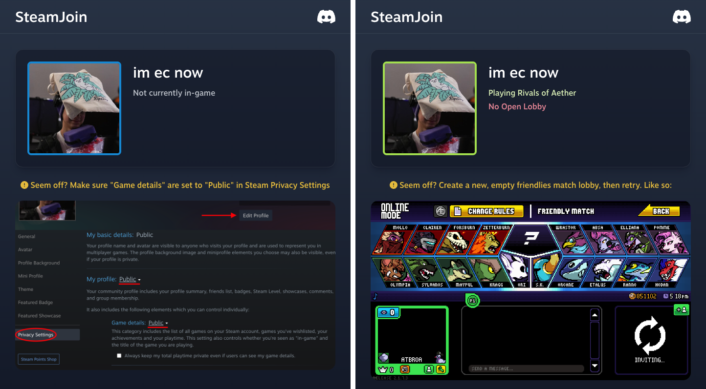

Built with [Go](https://go.dev), [go-chi](https://go-chi.io), [Tailwind CSS](https://tailwindcss.com), [discord.py](https://discordpy.readthedocs.io), and [redis](https://redis.io)

SteamJoin was originally created as a supplement to [Mentorbot](/mentorbot) `/invite` command, but now functions as a separate Discord bot and standalone service allowing users to quickly and seamlessly invite others to their Steam games.

## The Problem

Over the years of the game's lifespan, the [Rivals of Aether](https://rivalsofaether.com/) gaming community's preferred method to organize tournament matches evolved from using Steam search, to sharing your Steam Friend ID, to finally using Steam lobby links. This final process entails keeping a tab open of your own Steam profile, and copying the `Join Game` button to send to each new opponent, who then copy/pastes this link back into their own browser.



This came to be the standard by being the least involved process with the tools available, but we can definitely make it better.

## The Solution Pt. 1

To improve the UX of inviting, the process should be kept entirely within Discord rather than requiring that a Steam window of the user's profile remain on hand. Using Discord's API and integrated app/bot platform stands out as the clear answer, making the process now as simple as typing `/invite` in the chat.

On first use, users first input their Steam ID or profile link, which is then stored persistently in a [Redis Database](https://redis.io/docs/management/persistence). At the time of writing, over 750 users have linked their accounts.

If a problem is faced along the way, the user is given troubleshooting instructions.

## The Glow Pt. 2

Now to improve the UX of the player being invited, we need a clickable join game link rather than one that needs to be copy/pasted into a browser.

At its core, **steamjoin.com** simply requests and parses Steam API responses, then uses the [Steam browser protocol](https://developer.valvesoftware.com/wiki/Steam_browser_protocol) to redirect into Steam on success.

The same troubleshooting instructions as on Discord are displayed if a problem is faced.

[go-chi](https://go-chi.io) dynamic routing and JavaScript unify the search and redirect implementation, and a single [Go Template](https://pkg.go.dev/text/template) is styled with [Tailwind CSS](https://tailwindcss.com) before server rendering response.

## Result

All in all, this comes together to create a much more quick and seamless user experience: We've gone from players needing to Alt+Tab and copy/paste across three different programs to everything being done through Discord.

Upon its release, SteamJoin quickly became the standard for tournament and general matchmaking across the game's community.
