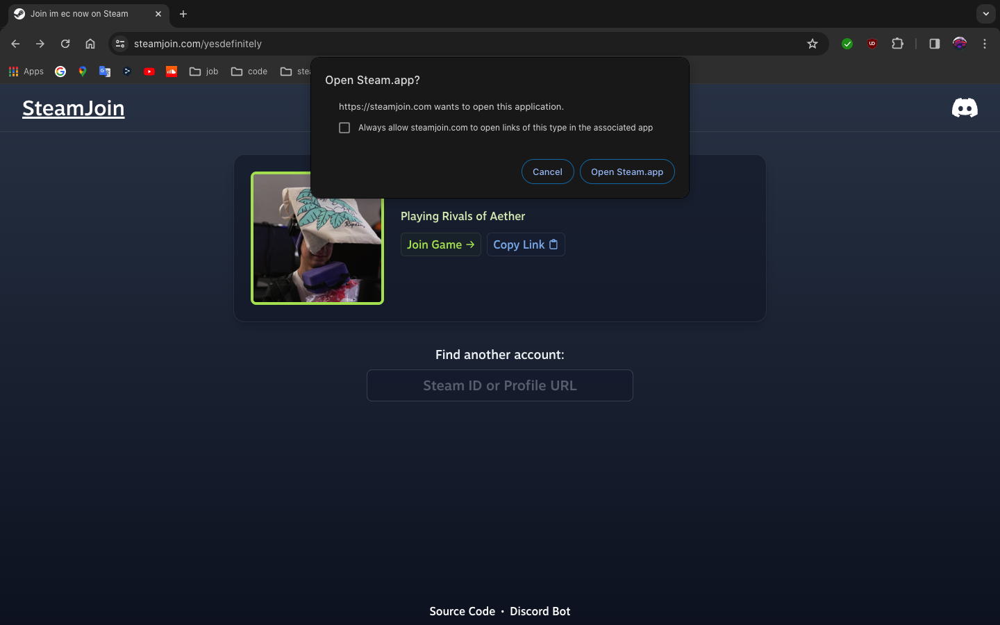

Built with [Go](https://go.dev), [go-chi](https://go-chi.io), and [Tailwind CSS](https://tailwindcss.com)

SteamJoin was originally created as a supplement to [Mentorbot's](/mentorbot) `/invite` command, but also functions as a standalone service, allowing users to quickly and seamlessly invite others to their Steam games.

## Core Functionality

At its core, SteamJoin simply requests and parses Steam API responses, then uses the [Steam browser protocol](https://developer.valvesoftware.com/wiki/Steam_browser_protocol) to redirect into Steam on success.

If a problem is faced, troubleshooting instructions are displayed instead.

[go-chi](https://go-chi.io) dynamic routing and JavaScript unify the search and redirect implementation, and a single [Go Template](https://pkg.go.dev/text/template) is styled with [Tailwind CSS](https://tailwindcss.com) before server rendering response.
